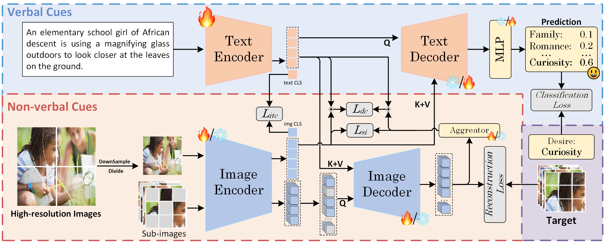
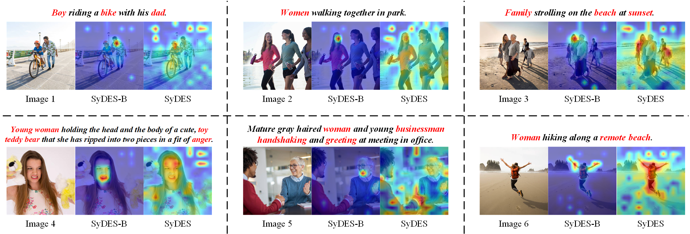

# SyDES

This is the official repository for our [SyDES]() model.

## Illustration



## Attention Map with Modal Perception



## Data Preparation

1. Download the [MSED](https://github.com/MSEDdataset/MSED) and save it to the `playground/data` directory.
2. Run the preparation script:
   ```bash
   python playground/prepare_msed.py
   ```

## Evaluation

### Pre-training
```bash
python main.py --config configs/pretrain_msed.yaml --mode train
```

### Fine-tuning
For sentiment analysis:
```bash
python main.py --config configs/finetune_msed_sentiment.yaml --mode train --model_path [pretrained_model_path]
```

For emotion recognition:
```bash
python main.py --config configs/finetune_msed_emotion.yaml --mode train --model_path [pretrained_model_path]
```

For desire understanding:
```bash
python main.py --config configs/finetune_msed_desire.yaml --mode train --model_path [pretrained_model_path]
```

## Citation

If you use our work, please cite.

## Acknowledgments

Our implementation uses code from the following repositories:
- https://github.com/facebookresearch/mae
- https://github.com/mlfoundations/open_clip
- https://github.com/huggingface/huggingface_hub

We appreciate their contributions to the community.

## Contact

For any questions, please email us.